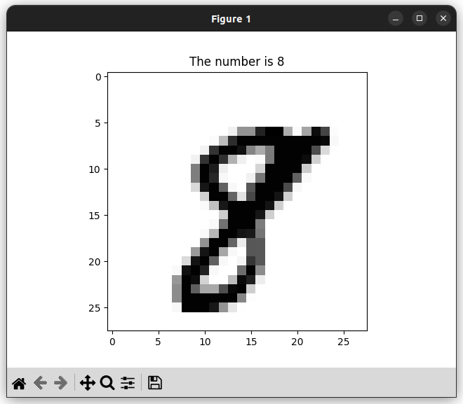

# Neural Network From Scratch
This is a minimal implementation of a feedforward Neural Network (Multi-layer perceptron)....and also my first ever neural network.



### Requirements
* Install Python3 & Python Poetry
* On GNU/Linux have python3-tk installed

### Usage
```Python
python nn.py
```

### What does it do?

This model does the classical tasks of identifying digits (0-9) from a 28x28 image and displays the result along with the image using matplotlib.